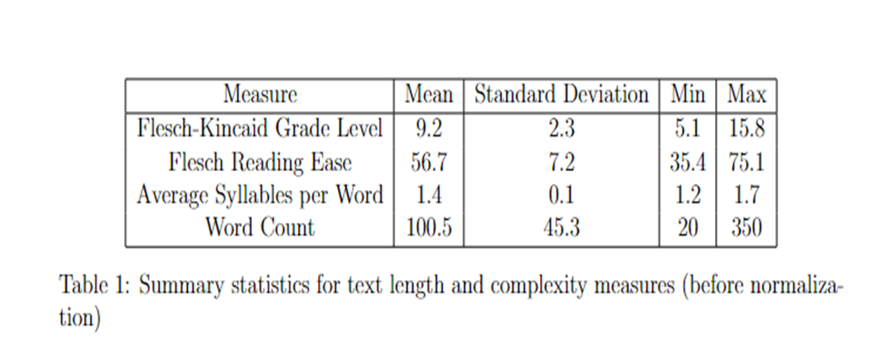
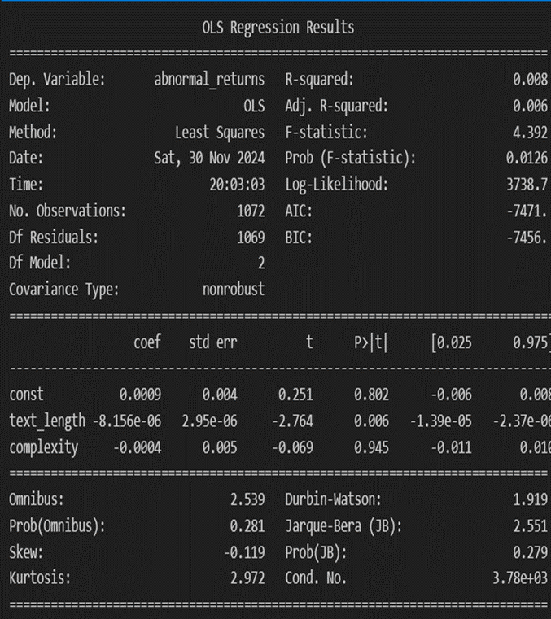

# 📈 Text Complexity and Stock Price Reactions

This project investigates whether the **length** and **complexity** of CEO M&A (mergers & acquisitions) announcements influence **short-term stock market reactions**.  

It was created as part of a university project.

---

## 🔍 Research Question
Do longer or more complex announcements affect investor reactions in the stock market?  
- **Hypothesis:**  
  - Complex language might indicate attempts to mask issues or oversell a deal, creating uncertainty.  
  - Shorter, straightforward announcements might reflect confidence and transparency.  

---

## 🗂 Data Collection and Preprocessing
- **Sources**:  
  - M&A announcements (company press releases)  
  - Stock price data from **Refinitiv Eikon** (not shareable due to license)  
- **Filtering**:  
  - US-based financial companies  
  - Announcements within the last 10 years  
  - Excluded firms with limited trading history  

- **Stock Price Treatment**:  
  - Computed **logarithmic returns**:  
    \[
    r_t = \ln\left(\frac{P_t}{P_{t-1}}\right)
    \]
  - Estimation window: **–110 to –10 days before announcement**  
  - Event window: **Day 0 to +5 after announcement**  
  - Measured **Abnormal Returns (AR)** and **Cumulative Abnormal Returns (CAR)**  

---

## 🧮 Text Features
- **Length** → Word count  
- **Complexity metrics**:  
  - Flesch–Kincaid Grade Level  
  - Flesch Reading Ease (inverted)  
  - Average syllables per word  
- Final **Complexity Index**: normalized combination of the above  

---

## 📊 Descriptive Statistics
  

*Table 1: Summary statistics of text features before normalization.*  

---

## 📉 Regression Analysis
I ran an **OLS regression** with abnormal stock returns as the dependent variable and text features as predictors.  

  

*Regression results: text length is statistically significant but the effect size is negligible; complexity has no meaningful effect.*  

---

## 🔑 Key Findings
- **Text Length**: statistically significant, but effect size is **negligible**.  
- **Text Complexity**: not a significant predictor of stock price reactions.  
- **Overall R²**: very low (≈0.008) → text features explain almost none of the variation.  

---

## 📌 Conclusion
- Market reactions to M&A announcements **do not depend on text complexity**.  
- **Text length** may have a very slight effect, but economically it is negligible.  
- **Future directions**:  
  - Explore additional text features (tone, sentiment, framing).  
  - Apply advanced ML models (e.g., random forest, transformers).  
  - Extend to broader datasets beyond financial companies.  

---

## 📂 Files
- **analysis.ipynb** → Jupyter notebook with the full analysis.  
- **presentation.pptx** → Project presentation.  
- **sample_data.csv** → Example dataset (for demo only).  
- **requirements.txt** → Python libraries needed.  
- **images/** → Figures used in this README.  

---
